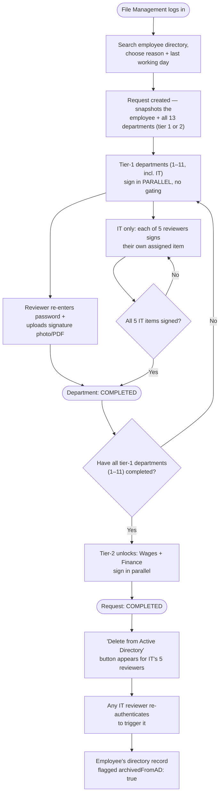
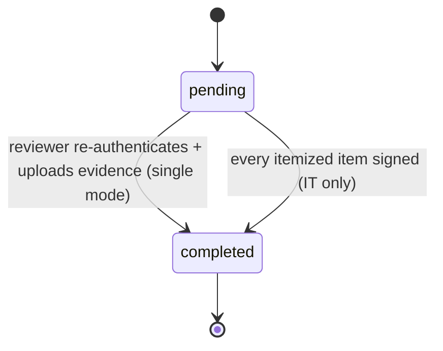

# EGAS Employee Clearance System

Digital replacement for EGAS's paper "إخلاء طرف" (clearance) process. When an
employee retires or resigns, **File Management (إدارة الملفات)** files a
clearance request on their behalf — the employee never logs in. Each of the 13
departments on the paper form reviews and signs off; departments 1–11 sign in
parallel, and the last two (Wages, Financial Affairs) are gated behind all of
the first 11 and get a full oversight dashboard. IT is department #10 and, once
every one of the 13 has signed, gets a manual "Delete from Active Directory"
button.

This repo went through a full workflow revamp on 2026-08-03 to match how the
real paper process actually works (see `CLAUDE.md` for the full design). It's
wired up generically enough (config-driven department order/tier/signature
mode) that real per-department detail can still change without rearchitecting
anything.

## Quick start

Requires Node.js 18+ and a local MongoDB (or a free MongoDB Atlas cluster —
either works, just point `MONGO_URI` at it).

```bash
# Backend
cd backend
npm install
cp .env.example .env        # edit MONGO_URI if not using local MongoDB
npm run seed                # creates departments, staff accounts, employee directory

# Frontend
cd ../frontend
npm install

# Back at the repo root: runs both dev servers together
cd ..
npm install
npm run dev                 # backend on :4000, frontend on :5173
```

(`npm run dev` at the repo root uses `concurrently` to start both — you can
still run `npm run dev` inside `backend/` and `frontend/` separately in two
terminals if you prefer.)

Open http://localhost:5173. Everyone's password is `Passw0rd!`.

| User ID | Role | Notes |
|---|---|---|
| `file.management` | File Management | files new clearance requests, sees a high-level status summary of their own requests |
| `<departmentKey>.reviewer1` / `reviewer2` | reviewer | every department except IT — any one of the pair can sign |
| `it.<itemKey>.reviewer` | reviewer (IT) | 5 accounts, one per itemized checklist item (`mobile_data_lines`, `phone`, `pc_account_mailbox`, `sap_service`, `sap_account_removal`) |
| `wages.reviewer1` / `finance.reviewer1` | reviewer (oversight) | same single-signature flow as any department, plus the full 13-department status grid for every request |

See `backend/src/seed/users.data.js` for the complete list, and
`backend/src/seed/employees.data.js` for the mock employee directory File
Management picks from when filing a request.

Tip: the login page also has a collapsible **"Demo accounts"** panel that
lists the accounts above and fills the form in for you on click — see
`frontend/src/demoAccounts.js` (temporary, for testing only).

To confirm the whole flow works end to end (tier locking, single vs itemized
signing, visibility redaction, AD deletion) after `npm run seed` + `npm run dev`:
```bash
cd backend
node scripts/smoke-test.js
```

## How the clearance workflow works

1. **File Management logs in** and files a request on an employee's behalf:
   search the employee directory by number or name
   (`GET /api/employees/search`), pick one, choose why they're leaving —
   **resignation**, **moving to a new company**, or **retirement** (Egypt's
   mandatory age-60 policy, "المعاش") — plus a suggested last working day.
   The employee themselves never logs in or touches the system.
2. The request snapshots the employee's directory record and every
   department's current template at that moment, so later edits never change
   requests already in flight.
3. **Departments 1–11 (including IT) sign in parallel** — no gating between
   them. Departments 12–13 (Wages, Financial Affairs) are locked until all of
   1–11 have signed, then unlock together.
4. **Signing = re-authentication + evidence upload**, not a checkbox: a
   reviewer re-enters their own password and uploads a photo or PDF of the
   physical signature/stamp for that specific request. Any one of a
   department's 2+ reviewers can sign it (12 of 13 departments). There's no
   separate "confirm"/finalize step and no reject/hold flow — a department is
   either unsigned or signed.
5. **IT is the one exception**: 5 checklist items (mobile & data lines,
   phone, PC/account/mailbox, SAP service, SAP account removal), each
   permanently owned by one of IT's 5 reviewer accounts. IT's department
   entry completes once all 5 have individually signed their own item.
6. **Visibility is need-to-know**: departments 1–11 (including IT) only ever
   see their own slice of a request — never what other departments have
   signed. Wages and Finance additionally get a full 13-department oversight
   grid for every request. File Management sees only a high-level progress
   summary of requests they filed — department status, no signer identity or
   evidence.
7. Once **all 13 departments have signed**, the request is `completed`, and
   a **"Delete from Active Directory"** button appears for IT's 5 reviewers
   (re-authenticate again, no file) — independent of IT's own position (#10)
   in the order. This flips `archivedFromAD: true` on the employee's
   directory record.
8. At any point, File Management (their own completed requests only) or a
   Wages/Finance reviewer (any request, any time, as a live preview) can
   download a composited PDF of the original paper form with each signed
   department's evidence photo placed in its row.

### Request lifecycle



### Department status states

Much simpler than before — no more "rejected" state, no separate finalize
step. This is the state machine `computeOverallStatus()` and the sign/
archive-ad routes in `backend/src/routes/request.routes.js` implement:



A request's overall `status` is `"completed"` once every one of its 13
department entries is `"completed"` — otherwise `"in_progress"`.

## Known gaps / things that still need real-world input

These are intentional placeholders, not bugs — see `PROJECT_STATUS.md` for the
live tracker.

- **No real Active Directory/LDAP integration yet.** Both staff logins
  (`User`) and the employee directory (`Employee`) are mock MongoDB
  collections. See "mock Active Directory" in `CLAUDE.md` for exactly what
  changes when real LDAP access is available.
- **"Temporary database" design for AD-deleted employees is a placeholder.**
  Right now we just flag the `Employee` record `archivedFromAD: true` instead
  of actually deleting anything. The brief mentions a more careful design is
  needed here — that's an open design task, not yet solved.
- **PDF compositing only embeds image evidence.** A PDF upload is stored and
  servable but renders as a text placeholder in the composited form rather
  than being embedded — see `backend/src/services/clearancePdf.js`.
- **The paper-form row coordinates in `clearancePdf.js` are hand-calibrated
  against one scanned copy.** If a cleaner/different scan replaces
  `backend/assets/clearance-form-template.pdf`, those coordinates need
  re-tuning (instructions are in that file's comments).
- **The "demo accounts" card on the login page is temporary**, for local
  testing/demos only — see `frontend/src/demoAccounts.js` for the note on
  removing it once real accounts exist.

## Tech stack

Backend: Node.js, Express, MongoDB/Mongoose, JWT (jsonwebtoken), bcryptjs,
multer (file uploads), pdf-lib (PDF compositing).
Frontend: React, Vite, React Router, react-i18next (Arabic default, RTL support).
