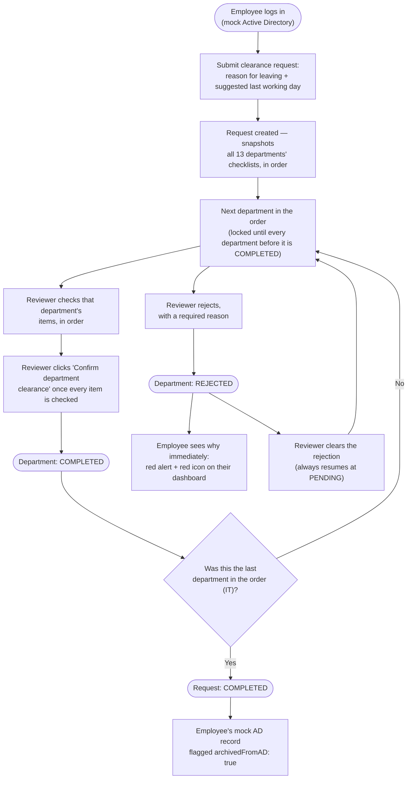
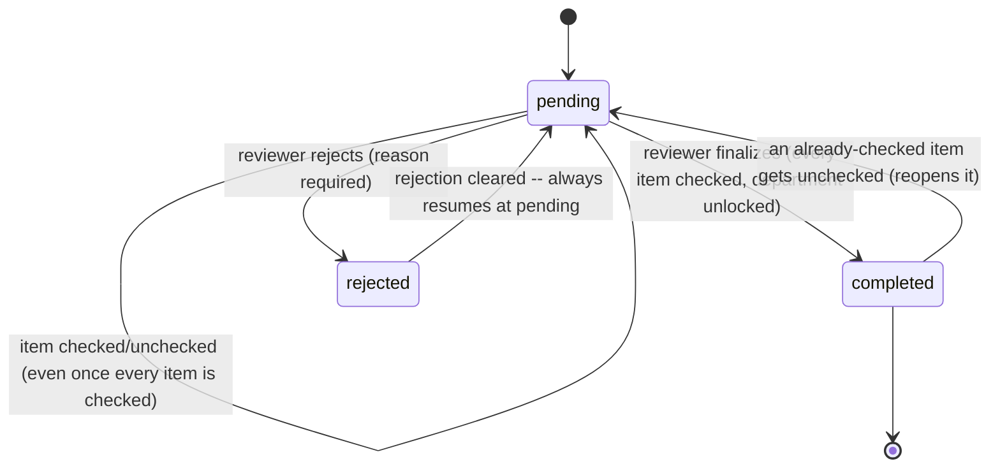

# EGAS Employee Clearance System

Digital replacement for EGAS's paper "إخلاء طرف" (clearance) process. An employee
retiring or resigning submits one request online; each of the 13 departments
checks off their own requirements for that employee instead of signing a paper
form. The IT department's checklist always finishes last, since its last step
deletes the employee from Active Directory.

This repo is an early prototype (originally built for a Monday demo) — a
login + submit request + per-department review vertical slice, wired up
generically enough that the other 15 departments can be filled in with real
requirements later without rearchitecting anything.

## Quick start

Requires Node.js 18+ and a local MongoDB (or a free MongoDB Atlas cluster —
either works, just point `MONGO_URI` at it).

```bash
# Backend
cd backend
npm install
cp .env.example .env        # edit MONGO_URI if not using local MongoDB
npm run seed                # creates departments + mock AD users

# Frontend
cd ../frontend
npm install

# Back at the repo root: runs both dev servers together
cd ..
npm install
npm run dev                 # backend on :4000, frontend on :5173
```

(`npm run dev` at the repo root uses `concurrently` to start both — you can
still run `npm run dev` inside `backend/` and `frontend/` separately in two
terminals if you prefer.)

Open http://localhost:5173. Everyone's password is `Passw0rd!`.

| Username | Role | Notes |
|---|---|---|
| `sara.employee` | employee | fresh account, no request submitted yet |
| `mohamed.retiring` | employee | all 12 non-IT departments already completed — log in as `it.reviewer` to demo the final IT gate directly |
| `admin` | admin | can check off, finalize, or reject any department, for testing |
| `it.reviewer` | reviewer | IT department, the 9-step ordered checklist |
| `<departmentKey>.reviewer` | reviewer | every other seeded department (see `backend/src/seed/users.data.js`) |

Tip: the login page also has a collapsible **"Demo accounts"** panel that
lists all of the above and fills the form in for you on click — see
`frontend/src/demoAccounts.js` (temporary, for testing only).

To confirm the whole flow works end to end (sequential department gating,
item ordering, and the finalize step) after `npm run seed` + `npm run dev`:
```bash
cd backend
node scripts/smoke-test.js
```

## How the clearance workflow works

1. The employee logs in (mock Active Directory) and submits a request,
   choosing why they're leaving — **resignation**, **moving to a new
   company**, or **retirement** (Egypt's mandatory age-60 policy, "المعاش")
   — plus a suggested last working day. Their department comes from the AD
   login itself, not a form field.
2. The request snapshots every department's current checklist template at
   that moment, so later edits to a department's template never change
   requests already in flight.
3. Departments process strictly in order, not in parallel: a department is
   locked — hidden from that reviewer's queue entirely, 403s on direct
   access, 409s on any action — until every department before it in the
   request's order has fully completed its own clearance. Items WITHIN an
   unlocked department must still be checked in sequence. IT is simply last
   in that order, so nothing IT-specific is hardcoded anywhere to make it
   "go last."
4. Checking every item on a department's checklist doesn't complete it —
   that's just prep. A reviewer/admin has to explicitly click **"Confirm
   department clearance"** to finalize it, matching a real signature rather
   than an implicit side effect.
5. Instead of finalizing, a reviewer can **reject** the department's
   clearance with a required reason — for when something's actually wrong
   (an unresolved item), not just "not done yet." A rejection immediately
   blocks the whole request and shows the reason on the employee's
   dashboard until a reviewer or admin clears it, which always resumes the
   department at "pending" (even if every item is already checked —
   finalizing is still a separate, explicit step).
6. IT's checklist is fixed and ordered: Phone → PC → Mobile Line → Data Line →
   Account → Mailbox → SAP Services → SAP Account → Delete from Active Directory.
   Checking that last item also has its own one-time confirmation dialog,
   since it's the actual "delete this person from Active Directory" action.
7. Once IT — the last department in the order — is finalized, the whole
   request is marked `completed` and the employee's mock AD record is
   flagged `archivedFromAD: true`.

### Request lifecycle



### Department status states

Every department entry on a request is one of three states. This is the
state machine `computeOverallStatus()` and the finalize/reject/item-check
routes in `backend/src/routes/request.routes.js` implement:



A single `rejected` department is enough to flip the *entire request's*
status to `rejected`, regardless of how far every other department got — see
`computeOverallStatus()`.

> **Display note:** the employee's progress grid colors departments green
> (done), gold (the next one still needed), gray (further down the list), or
> red (rejected) purely from each department's status and its position in the
> list. As of the sequential-processing change (2026-08-02), this accurately
> reflects real backend enforcement — the gold department really is the only
> one currently unlocked and actionable, not just a display simplification.

## Known gaps / things that still need real-world input

These are intentional placeholders, not bugs — see `PROJECT_STATUS.md` for the
live tracker.

- **Only IT's checklist is real.** Every other department currently has one
  generic placeholder checklist item ("No outstanding items"). Someone needs to
  sit with each department and write down their actual requirements, then update
  `departments.data.js` — no other code changes needed.
- **No real Active Directory/LDAP integration yet.** Login checks a mock `User`
  collection in MongoDB that mimics AD. See "mock Active Directory" in
  `CLAUDE.md` for exactly what changes when real LDAP access is available.
- **"Temporary database" design for AD-deleted employees is a placeholder.**
  Right now we just flag the same Mongo record `archivedFromAD: true` instead of
  actually deleting anything. The brief mentions a more careful design is needed
  here (so an employee can still log in and see their completed clearance after
  IT "deletes" them) — that's an open design task, not yet solved.
- **No manager-vs-staff distinction within a department.** Everyone who reviews
  for a department currently has the same `reviewer` role. If a department needs
  a "staff checks, then manager approves" step, that's a schema change to
  `checklistItems`, not yet designed.
- **The "demo accounts" card on the login page is temporary**, for local
  testing/demos only — see `frontend/src/demoAccounts.js` for the note on
  removing it once real accounts exist.

## Tech stack

Backend: Node.js, Express, MongoDB/Mongoose, JWT (jsonwebtoken), bcryptjs.
Frontend: React, Vite, React Router, react-i18next (Arabic default, RTL support).
